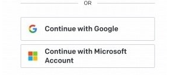
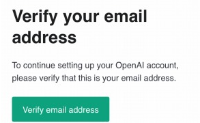
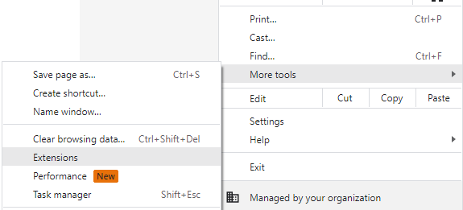

<!--_class: top-->

# Introduce chatgpt 
## KitAIclub
## Tyukei

---
<!--_class: impact lead invert-->
### Today, what is the best AI?

---
<!--_class: impact lead invert
paginate: false -->
### Yes, Chat GPT!!

---
<!--_class: impact lead invert 
paginate: true -->
### BUT Have you ever used that?

---
<!--_class: impact lead invert-->
### Let's gonna start it!

https://chat.openai.com/chat

---
<!--_class: normal-->
# How to do that
1. https://openai.com/blog/chatgpt
1. click Try ChatGPT

1. login

---

4. if you have google or microsoft account,
you can use it or register e-mail

5. verify your email

---

6. register phone number

7. enter code

8. agree for service

9. you can start

----
<!--_class: normal-->
# Tips 1

## create shortcut
more tools/Create shortcut...

----
<!--_class: normal-->
# Tips 2

## Extension
[ChatGPT for Google](https://chrome.google.com/webstore/detail/chatgpt-for-google/jgjaeacdkonaoafenlfkkkmbaopkbilf)

[demo](https://youtu.be/jhjNmqXSRYI)

----
<!--_class: final-->
# Thank you 