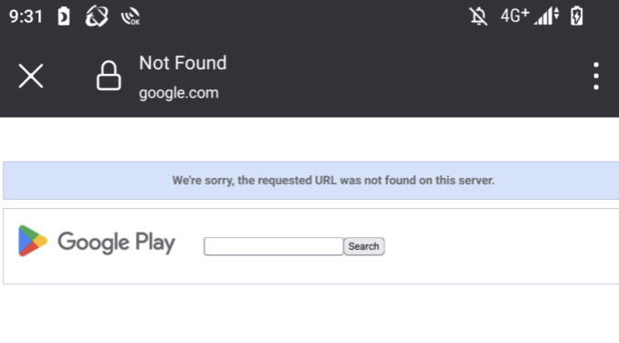
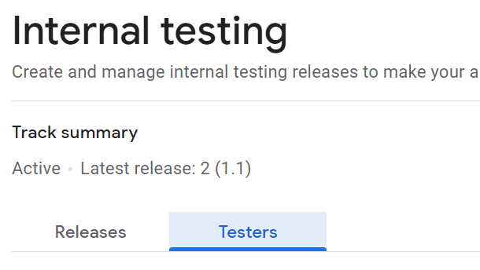
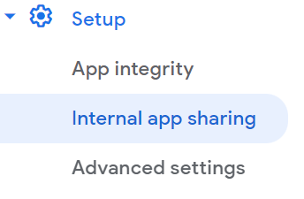

# Internal Test

## When I share app as Internal test, team members can't see the app in Google Play

# What is Internal Test?

## Advantage
- you can share app instantly with team members.
- (publish need time to check app is safe or not.)

## Disadvantage
- you cannot edit and delete the app till term of internal test.
- (publish can be edit and delete after upload.)

# Solution

## 1. add email

## 2. accept term of internal test

## 3. make sure device is developer mode
https://developer.android.com/studio/debug/dev-options?hl=ja