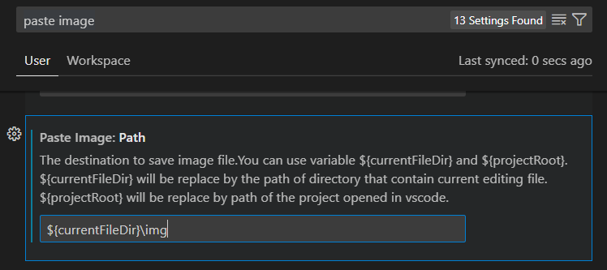
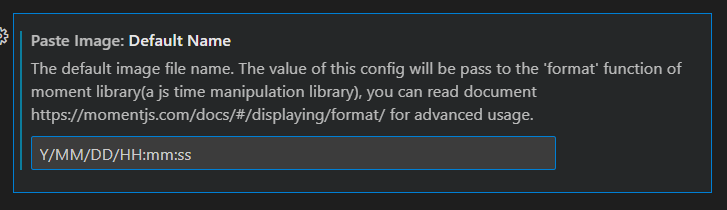
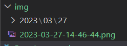

# Paste Image

# Document [LINK](https://marketplace.visualstudio.com/items?itemName=mushan.vscode-paste-image)

# What is Paste Image?
If you want to paste an image into a markdown file, you can use this extension.

You don't have to save the image file and then paste it into the markdown file.

# How to use Paste Image?

1. for windows, press `win+shift+S` to copy image.
2. for windows, press `Ctrl+Alt+V` to paste image.
3. automatically save the image file named date of today.

# How to change the path of the image file?

1. open setting page
2. type `pasteImage`
3. find `Paste Image: Path` and change

# How to change the name of the image file?

1. open setting page
2. type `pasteImage`
3. find `Paste Image: Default Name` and change

## you should not use `\` or`:` 

if you use `\`, you make unexpected folder

if you use `:`, you cannot make iamge.

