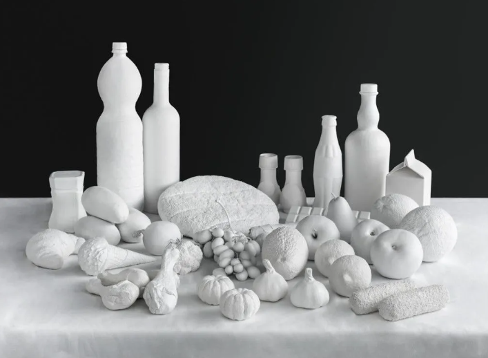

search paper by google scholor

# plan
1. watch the video by kajimura prf
2. serach paper by using keyword
3. find another paper

# note

- [⽣体情報 機能評価]
    - 医療系。環境系多い
- [⽣体情報 機能評価　データサイエンス]
    - データサイエンスの記事はあるけど、生体情報と結びついているものはない
- [⽣体情報 データサイエンス]
    - おなじく、見当たらない
- ⽣体情報 : biological information
- 機能評価 : functional evaluation
- 生体時計 : biological clock

- [biological information　data science]
    - there are seem to be more

## The Quantified Self: Fundamental Disruption in Big Data Science and Biological Discovery
https://www.liebertpub.com/doi/full/10.1089/big.2012.0002

Quantified Self: 自己の定量化

自分のことを数字で表すこと。

https://wired.jp/tag/quantified-self/

「365日分のフードレプリカ」をつくった男

https://wired.jp/2015/07/15/sculpted-everything-he-ate/

きっかけ：引っ越しで食生活が変わったことから。

方法：丸1年、彼はノートとペンを持ち歩き書く。丸一年ノートを見返さない。

一年後、食材の型をつくり、石膏を流し込んで固め、複製品を作った。

結果：「どれだけ多くのものを体内に取り込んでいるのか」、「どれだけそれらに無関心なのか」を視覚的に実感させた。

６０００個の作品すべてを販売した

- ノートに書くとか、あとで、モデルをつくるのは大変そう。
- でも、その分ほかの人がしていないから、差別化できる。
- あと、ノートにかかないと思うことで、間食を減らせそう。。。

