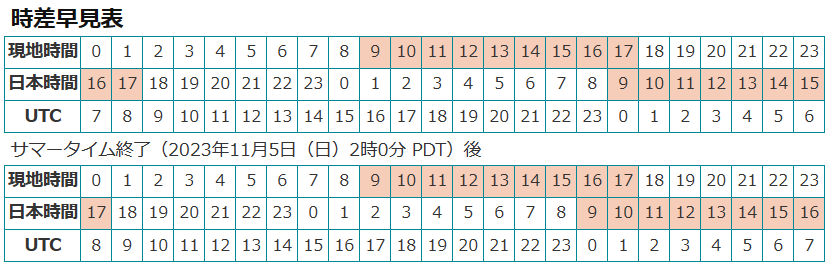

# 2023年4月12日(1回目)

# 卒業論文発表まで

<!-- generate table -->
| 内容|　日にち  |
| --- | --- |
|今日| 2023年4月12日 |
|卒業発表|2023年2月13日  |
|日数|307|
|週|43週|

# 卒業するまでに
- 卒業論文
- 研究室のHP
- アメリカに行きたい

# 興味あること
- 睡眠の研究
- 体内時計の可視化

# 聞きたいこと
- ~~slack~~
- ~~個別指導の日にち~~
- ~~グループワークの日にち~~
- ~~次回の日にちと内容~~

# 議事録
- 場所は自分にあったところ
→学校で受ける

- 木曜日9:00～10:00
学生、さの先生(テキサス、ライス大学)

- slack
先生のプロジェクトに入る：
デザイナー、エンジニア、ビジネスマン、学生(東大、OIST)

- グループ→　slack (data-science)

- しぶや先生の研究室：
積極的に参加していく
プログラミングや論文の輪読をしていく

- 水谷先生：
データ利用、開発などで関わっていく

# link
<!-- table -->
|date(jst)|context|link|
| --- | --- | --- |
|Mon 14:00～|private meeting|https://us06web.zoom.us/j/81350899585?pwd=MjZXTldiRnpCNlpuYW80TkljQU8vQT09|
|Thu 9:00～|group project|https://us06web.zoom.us/j/89719614316?pwd=QTUyWWtqWS9TcWtkcVlYSjcwMEIvUT09|
|once a 6 weeks|All Hands Meeting|https://us06web.zoom.us/j/88238162639?pwd=eUNHdDc3R1c0eEhlQkFyazB0ZCs2UT09|

# 今後の予定

## 個別指導: 月曜日１４時(5/8～)

## グループワーク: 明日９時～