# 中西さん

UCIの中西さん
- EEGLAB
- BCILAB
- LSL(計測をまとめる)

EEGLAB Workshop(興味ある人は)

## EEG
脳の部位と距離

## 脳波の発生
大脳皮質

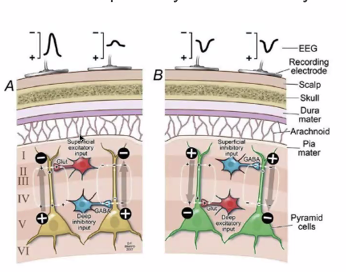

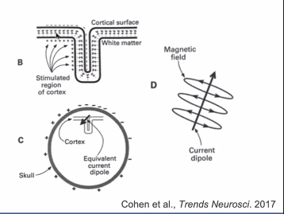

人によってしわが違うため、電極の向きは分からない

## 脳波の実験
１４ページ
平均　ERP
誘発電位→リアクションのとき
p3 誘導電位→ｘとOを判断する
p→プラスの電位
n→マイナスの電位
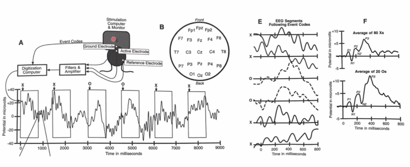
xとOを判断するとは位置？文字の形？
複数の脳の部位の平均の平均？

# 
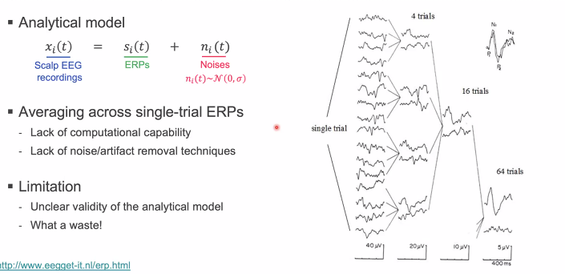

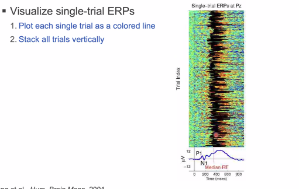

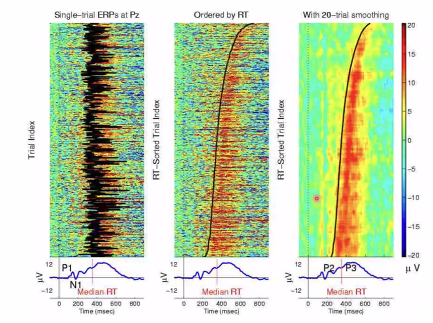

# 一つの信号源だけから電圧は測れない
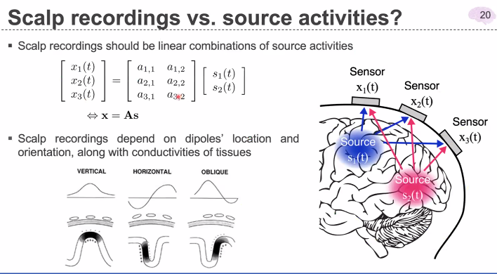

# 信号源推定
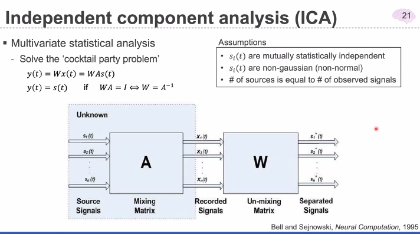

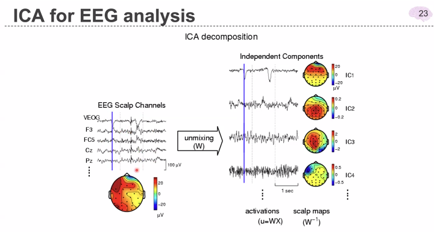

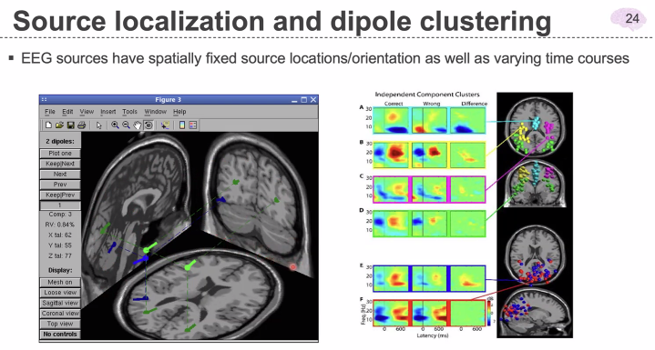

# scalp erp

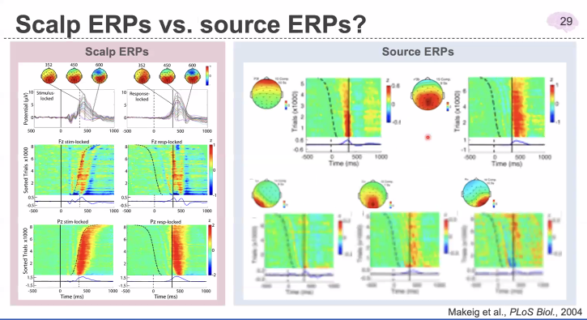

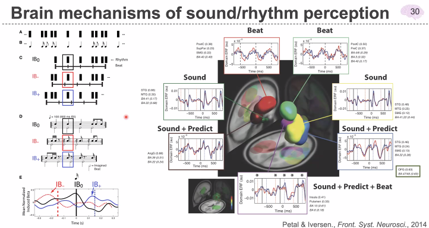

# 脳に与える影響はあるか？

# ２チャンネルwebletじゃダメ
時間解析するときはweblet

# 後頭部ならどこでもいい？
髪の毛がなければ、orジェルを使う

# 特徴量
EGLabは基本解析用で、特徴量は自分で作る
データ見て、スパイクがあれば、その周辺の特徴量を作る
周期的なら周波数
脳波と脈拍からサーカディアンリズムを作る
メラトニンの生成をとる
唾液から成分をはかる
くろだけでリズム計って見つけたというのは弱い
何十年とかかる

# 測定方法
python サイコパイ vep
openbci

# 耳の差分から解析する
tool/ rereference
窓関数を使う、fftをかける

