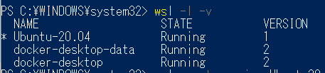
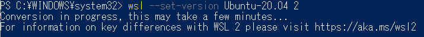
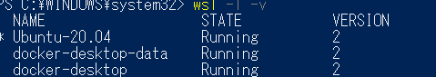

# docker is not work

```
curl -s https://laravel.build/app | bash
→docker is not running
```

## fix: change version
https://softantenna.com/blog/windows-10-20h1-wsl-2/

```
wsl.exe -l -v
```

you can see different form os and doccker version



you type this to fix it

```
wsl --set-version Ubuntu-20.04 2
```

but be careful, there is no option in wsl1

so firtst you have to use powershell and type 

```
wsl --set-version Ubuntu 2
```


at that time, you have to close all linux app.





