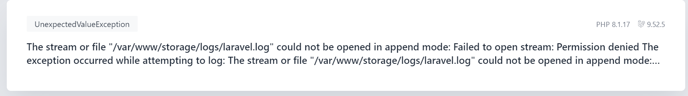

## open localhost and error


```
The stream or file "/var/www/storage/logs/laravel.log" 
could not be opened in append mode: 
Failed to open stream: Permission denied 
The exception occurred while attempting to log: 
The stream or file "/var/www/storage/logs/laravel.log" 
could not be opened in append mode: Failed to open stream: 
Permission denied The exception occurred 
while attempting to log: The stream or file
```


## how to slove
add Permission

1. ```docker-compose exec workspace bash```
2. ```chmod -R 777 storage bootstrap/cache```
3. ```exit```
4. check localhost
   
