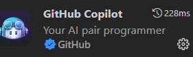
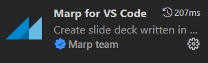
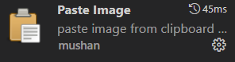

# Recommended Vscode Plugin

1. GitHubCopilot
1. Paste Image
1. Marp for VS Code
1. Code Spell Checker
1. Markdown Preview








# How to install

1. shortcut ```ctl + shi + x ```
or find extension icon
1. type name of you want plugin 
1. click install button
\* note: you may find varies things. 
In this case, it's better to install the most downloading


# How to use 

## Copilot
[Copilot](./Copilot.md)


## Paste Image
[PasteImage](./PasteImage.md)